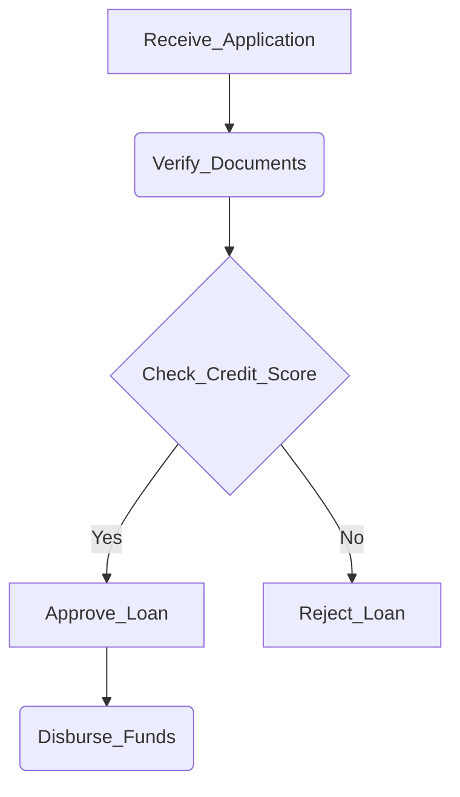

# Loan Application Workflow

```mermaid
flowchart TD
    A[Receive_Application]
    B(Verify_Documents)
    C{Check_Credit_Score}
    D[Approve_Loan]
    E[Reject_Loan]
    F(Disburse_Funds)
    A --> B
    B --> C
    C -- "Yes" --> D
    C -- "No" --> E
    D --> F
```